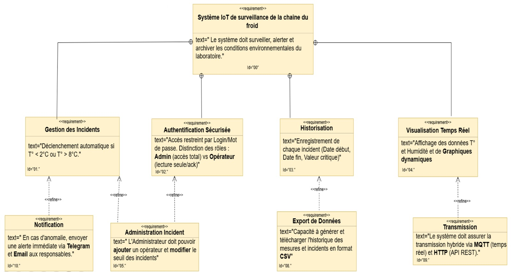
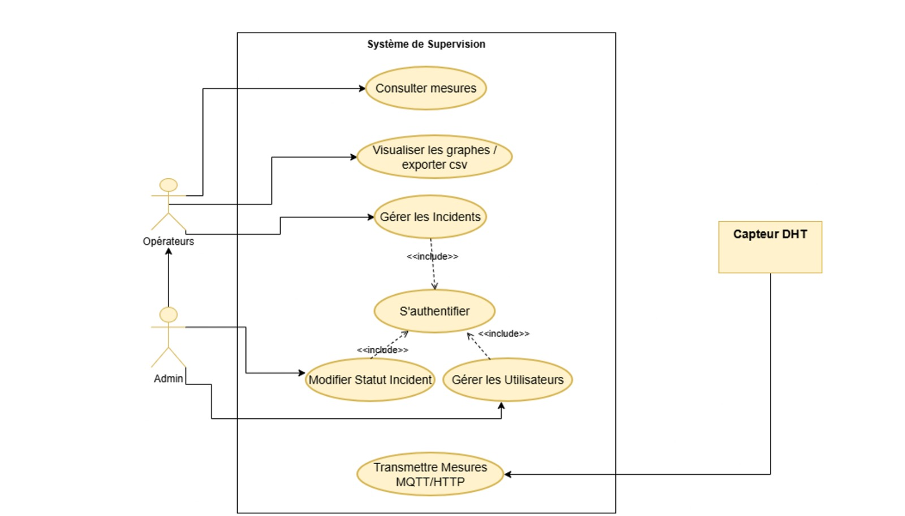
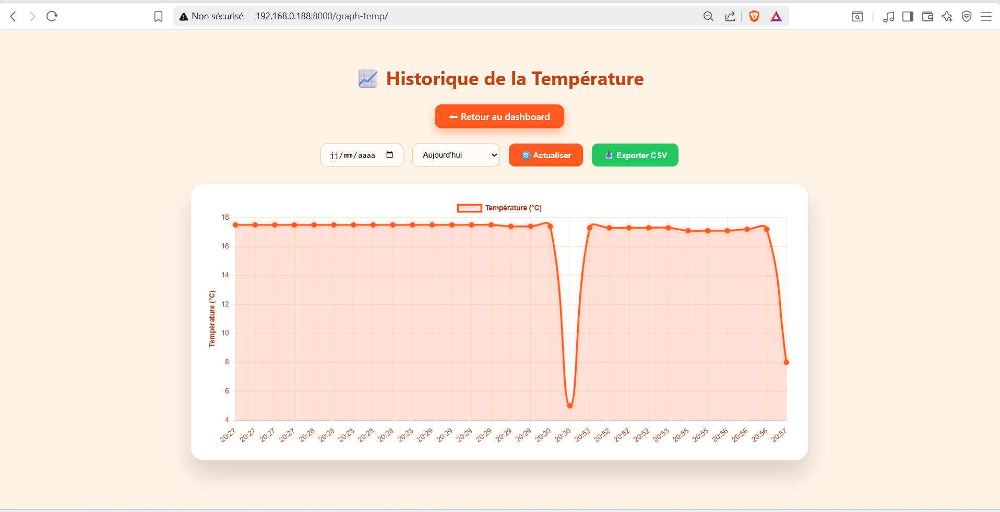
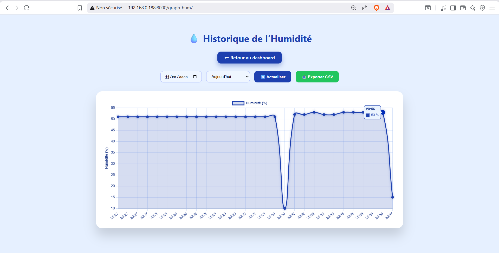
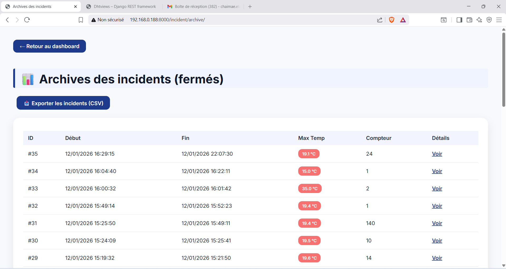
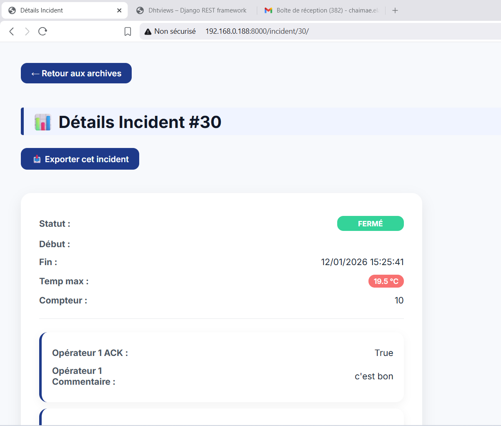
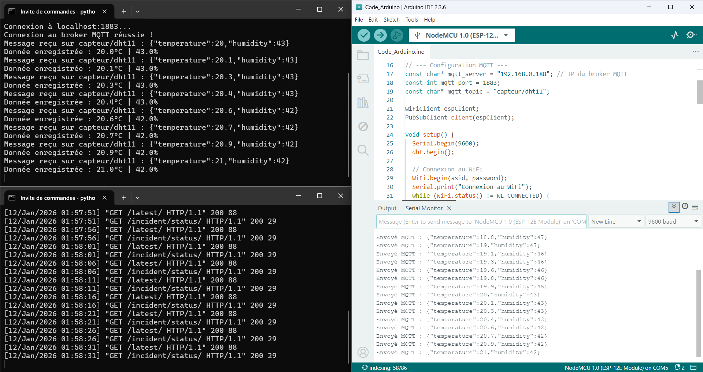
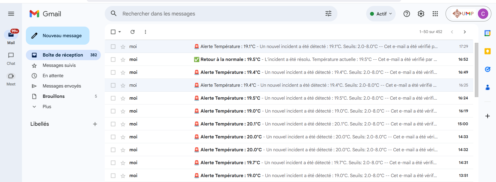
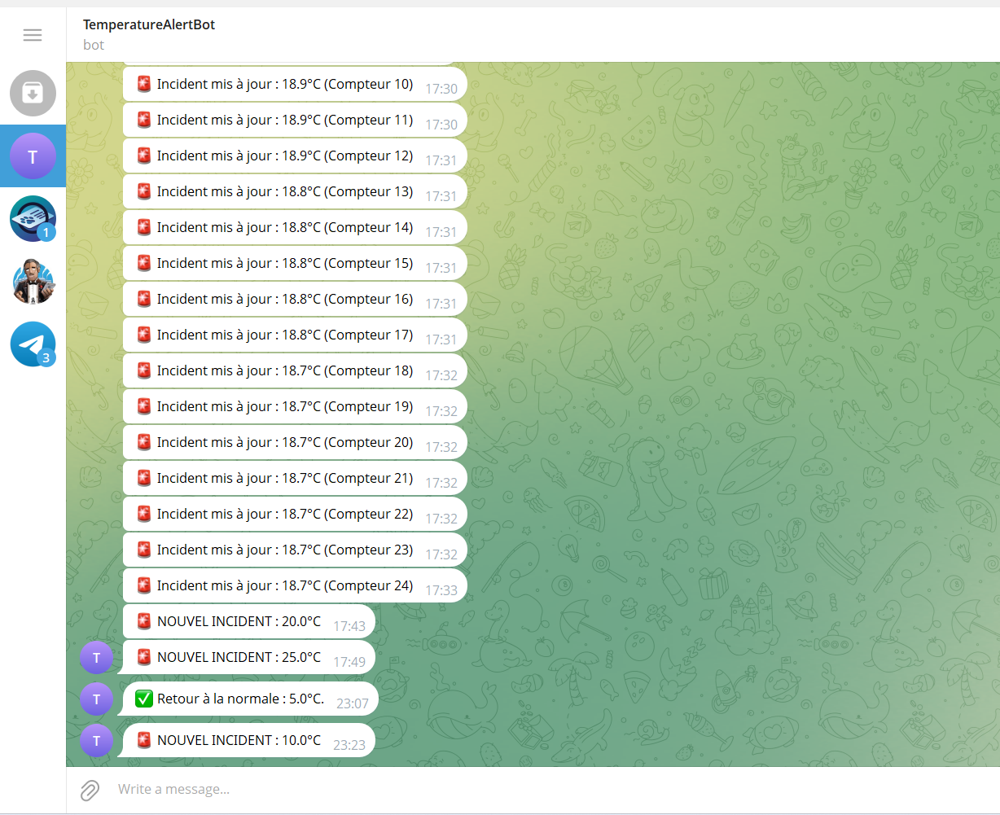

# ❄️ IoT Cold Chain Monitoring System

## 📝 Description
Ce projet consiste à concevoir un **système IoT intelligent et automatisé** pour la surveillance stricte de la chaîne du froid, conçu spécifiquement pour les **laboratoires d’analyses médicales**. Il permet le suivi en temps réel de la température et de l’humidité afin d'assurer la conservation optimale des produits hautement sensibles (échantillons biologiques et chimiques).
La plage de conservation de ces échantillons est strictement définie **entre 2°C et 8°C**.

## 👩‍💻 Réalisé par :
- **El Azimani Chaimae**
- **Bouras Jihane**

## 📌 Problématique
Dans les domaines médical, alimentaire et logistique, une rupture de la chaîne du froid peut entraîner des pertes importantes et fausser les résultats d'analyses. Il est donc essentiel de surveiller en continu les conditions environnementales et d’alerter rapidement en cas d’anomalie (surtout la nuit ou les week-ends).

## 🎯 Objectifs
-  Mesurer la température et l’humidité en temps réel
-  Visualiser les données via une interface web dynamique
-  Stocker les données de manière sécurisée dans une base de données
-  Envoyer des alertes instantanées en cas de dépassement de seuil
-  Assurer la traçabilité complète des mesures et des incidents

## 🧠 Architecture & Fonctionnement

### ⚙️ Flux de données :
- **Acquisition** : Le capteur DHT11 mesure la température et l’humidité.
- **Transmission** : L’ESP envoie les données via les protocoles MQTT / HTTP.
- **Traitement** : Le backend Django (API) réceptionne, traite et stocke les données dans la base de données.
- **Visualisation** : Les données sont affichées sur un Dashboard Web dynamique avec des graphiques évolutifs.
- **Notification** : Le système d'alerte surveille les données en continu et envoie des notifications (Email & Telegram) en cas d'anomalie.

### 📐 Conception SysML :
- **Diagramme d’Exigences :**

  

- **Diagramme de cas d’utilisation :**

  

## 🛠️ Matériel & Logiciel

### 🔌 Partie Matérielle (Hardware) :
- **Microcontrôleur** : ESP8266 / ESP32
- **Capteur** : DHT11 (Température & Humidité)
- **Câblage** : Câbles de connexion divers (Jumpers)
- **Énergie** : Alimentation électrique classique

### 💻 Partie Logicielle (Software) :
| Technologie | Utilisation |
|---|---|
| **Python (Django)** | Développement Backend & Création de l'API |
| **SQLite / MySQL** | Gestion de la Base de données |
| **HTML / CSS / JavaScript** | Création de l'Interface utilisateur (Frontend) |
| **Chart.js** | Génération des graphiques dynamiques |
| **MQTT / HTTP** | Protocoles de communication IoT |
| **Arduino IDE** | Programmation du microcontrôleur ESP |
| **Telegram API** | Envoi de notifications sur mobile |
| **SMTP (Gmail)** | Serveur pour l'envoi d’emails d'alerte |

## 📊 Interface Web et Tableau de Bord

### 🔐 Connexion & Dashboard Principal :
- **Connexion :**

  

- **Dashboard :**

  

### 📈 Suivi des données en temps réel :
- **Diagramme de Température :**

  

- **Diagramme d' Humidité :**

  

### ⚠️ Gestion des Incidents :
- **Archive d'incidents :**

  

- **Details des incidents :**

  

### 📡 Communication (Connexion MQTT) :

  

- **Commande lance un processus qui écoute les messages MQTT :** python manage.py mqtt_subscriber
- **Commande lance le serveur web Django :** python manage.py runserver 192.000.0.000:8000

## 🚨 Système d’alerte
Le système assure une surveillance continue. Dès qu'un dépassement de seuil est détecté (ex: Température > 8°C ou < 2°C), des notifications sont envoyées automatiquement pour permettre une intervention rapide :
- 📩 **Email** (via le protocole SMTP)

  

- 📱 **Telegram** (via l'API du Bot Telegram)

  

## 🚀 Perspectives et Améliorations Futures
Pour rendre ce système encore plus robuste et autonome à l'avenir, les évolutions suivantes sont prévues :
1. **Intégration d'une batterie de secours (Onduleur/Powerbank)** : Pour maintenir la surveillance active même en cas de coupure de courant au laboratoire.
2. **Développement d'une application mobile dédiée** : Pour offrir aux opérateurs une interface plus adaptée aux smartphones et un suivi plus ergonomique en déplacement.
3. **Alertes par SMS (Module GSM)** : Ajout d'une connectivité cellulaire pour envoyer des SMS d'urgence en cas de panne de la connexion Wi-Fi ou du réseau internet local.
